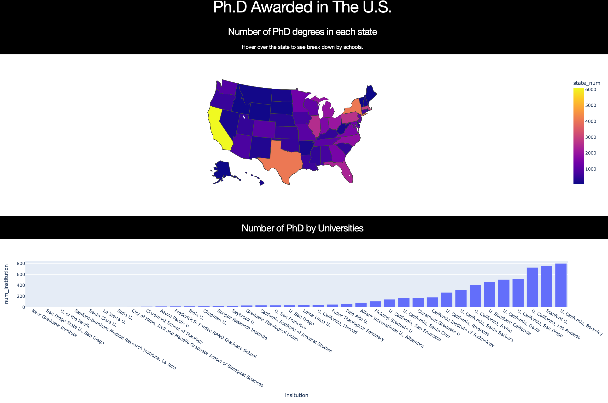

## PhD Awarded in The U.S. Dashboard

Using [the PhDs awarded in the U.S. dataset](https://ncses.nsf.gov/pubs/nsf19301/data), I demostrate how to make and deploy a dashboard in Python.

**Packages:**
- `plotly`
- `dash`
- Heroku

**Dataset:**
- [Doctorate-granting institutions, by state or location and major science and engineering fields of study: 2017](https://ncses.nsf.gov/pubs/nsf19301/assets/data/tables/sed17-sr-tab007.xlsx)

**Links:**
- [Blog article](https://jiamanbettywu.github.io/post/dashboard-phd/)
- [Dashboard](https://dashboard-app-bios823.herokuapp.com) 
